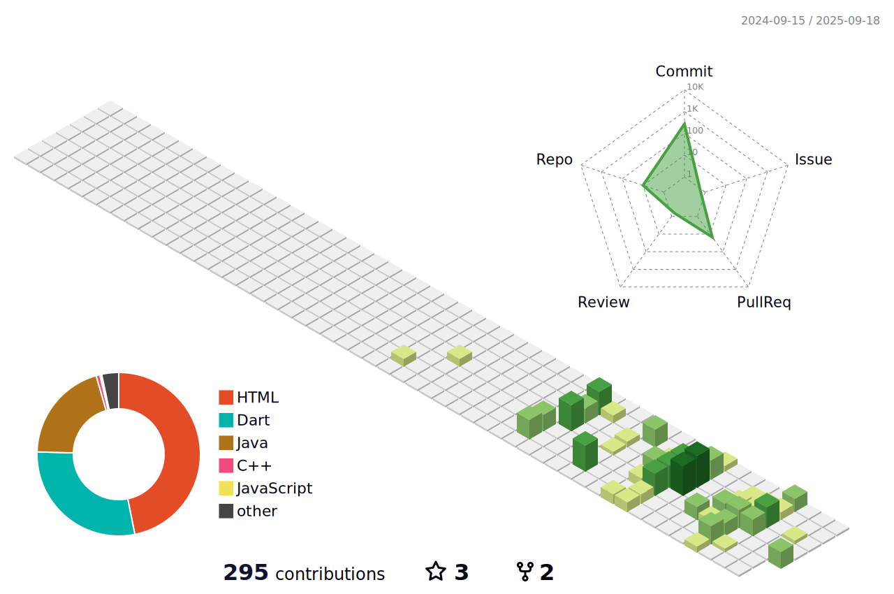

<!-- 헤더 -->

  💻 Backend & Mobile Developer — <strong>Java/Spring Boot</strong> · <strong>Flutter/Dart</strong>  
  🌱 Building reliable web services & delightful mobile apps  
  ✨ Always learning, always improving!

---

### 🧭 About
- Focus: **Java/Spring Boot 백엔드**, **Oracle/MySQL**, **JPA & MyBatis**, **JSP/Thymeleaf**
- 관심사: SSE 알림, JWT 리프레시, 대시보드/예약 시스템

---

### 🛠 Tech Stack 
<!-- STACK:START -->
       
<!-- STACK:END -->

---

### ⭐ Featured Projects
<!-- STARRED:START -->
- **[cha0cha0/bnk-project-1-2](https://github.com/cha0cha0/bnk-project-1-2)**     
  Open AI를 활용한 은행상품 판매를 위한 판매사이트 구축 프로젝트 입니다.
- **[cha0cha0/room-escape-BNKmini](https://github.com/cha0cha0/room-escape-BNKmini)**     
  Room Escape는 사용자 친화적인 방탈출 카페 예약 통합 플랫폼입니다. 다양한 테마의 방탈출 카페를 쉽게 검색하고 빠르게 예약할 수 있도록 설계되었습니다.
<!-- STARRED:END -->

---

### 🧊 3D Contributions

  <picture>
    <!-- 다크 모드: GitBlock -->
    <source media="(prefers-color-scheme: dark)" srcset="./profile-3d-contrib/profile-gitblock.svg" />
    <!-- 라이트 모드: Green -->
    <source media="(prefers-color-scheme: light)" srcset="./profile-3d-contrib/profile-green.svg" />
    <!-- 기본 폴백(라이트 가정) -->
    
  </picture>

---

### 📊 GitHub Stats

  
   
  
   
  

---

### 🏆 Trophies

  

---

### 🥇 BOJ Level

---

### ✉️ Contact
- Email: **cktngus4@naver.com**

<!-- 푸터 -->

